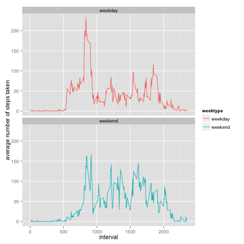

Assignment1 by Mandeep Paik
============================

### What is mean total number of steps taken per day?

####1. Calculate the total number of steps taken per day


```r
library("plyr")
library("dplyr")
library("ggplot2")
library("tidyr")
activity <- read.csv("activity.csv", header = TRUE, sep = ",", colClasses = c("integer", "Date", "factor"))
df <- activity %>%
  filter(!is.na(steps)) %>%
  group_by(date) %>%
  summarize(steps = sum(steps)) %>%
  print
```

```
## Source: local data frame [53 x 2]
## 
##          date steps
## 1  2012-10-02   126
## 2  2012-10-03 11352
## 3  2012-10-04 12116
## 4  2012-10-05 13294
## 5  2012-10-06 15420
## 6  2012-10-07 11015
## 7  2012-10-09 12811
## 8  2012-10-10  9900
## 9  2012-10-11 10304
## 10 2012-10-12 17382
## ..        ...   ...
```


#### 2. Make a histogram of the total number of steps taken each day


```r
hist(df$steps, breaks = 20, main = "Total number of steps taken each day", ylab = "Frequency", xlab = "Number of steps")
```

 


#### Calculate and report the mean and median of the total number of steps taken per day


```r
meansteps <- mean(df$steps)
mediansteps <- median(df$steps)
cat("Mean number of steps: ", meansteps, "Median number for steps:", mediansteps)
```

```
## Mean number of steps:  10766.19 Median number for steps: 10765
```


### What is the average daily activity pattern?

#### 1. Make a time series plot (i.e. type = "l") of the 5-minute interval (x-axis) and the average number of steps taken, averaged across all days (y-axis)


```r
interval.mean <- as.numeric(tapply(activity$steps, activity$interval, mean, na.rm = TRUE))
intervals <- data.frame(intervals = as.numeric(levels(activity$interval)), interval.mean)
intervals <- intervals[order(intervals$intervals), ]

labels <- c("00:00", "05:00", "10:00", "15:00", "20:00")
labels.at <- seq(0, 2000, 500)

plot(intervals$intervals, intervals$interval.mean, type = "l", main = "Average steps 5-minute interval", ylab = "Average number of steps", xlab = "Time of day", xaxt = "n")
axis(side = 1, at = labels.at, labels = labels)
```

 

#### 2. Which 5-minute interval, on average across all the days in the dataset, contains the maximum number of steps?


```r
intervals.sorted <- intervals[order(intervals$interval.mean, decreasing = TRUE), ]
ans <- intervals.sorted$intervals[[1]]
ans
```

```
## [1] 835
```


### Imputing missing values
#### 1. Calculate and report the total number of missing values in the dataset (i.e. the total number of rows with NAs)

```r
numOfNARows <- sum(is.na(activity$steps))
numOfNARows
```

```
## [1] 2304
```

#### 2. Devise a strategy for filling in all of the missing values in the dataset. The strategy does not need to be sophisticated. For example, you could use the mean/median for that day, or the mean for that 5-minute interval, etc.

The "NA" cells in steps will be populated with the average number of steps in the 5 minute interval

#### 3. Create a new dataset that is equal to the original dataset but with the missing data filled in

```r
data_filled <- activity
nas <- is.na(data_filled$steps)
avg_interval <- tapply(data_filled$steps, data_filled$interval, mean, na.rm=TRUE, simplify=TRUE)
data_filled$steps[nas] <- avg_interval[as.character(data_filled$interval[nas])]
```
Confirm there are no more NA values in the cells

```r
sum(is.na(data_filled$steps))
```

```
## [1] 0
```


#### 4. Make a histogram of the total number of steps taken each day and Calculate and report the mean and median total number of steps taken per day. Do these values differ from the estimates from the first part of the assignment? What is the impact of imputing missing data on the estimates of the total daily number of steps?


```r
steps_filled <- data_filled %>%
  filter(!is.na(steps)) %>%
  group_by(date) %>%
  summarize(steps = sum(steps)) %>%
  print
```

```
## Source: local data frame [61 x 2]
## 
##          date    steps
## 1  2012-10-01 10766.19
## 2  2012-10-02   126.00
## 3  2012-10-03 11352.00
## 4  2012-10-04 12116.00
## 5  2012-10-05 13294.00
## 6  2012-10-06 15420.00
## 7  2012-10-07 11015.00
## 8  2012-10-08 10766.19
## 9  2012-10-09 12811.00
## 10 2012-10-10  9900.00
## ..        ...      ...
```

```r
ggplot(steps_filled, aes(x = steps)) +
  geom_histogram(fill = "firebrick", binwidth = 1000) +
  labs(title = "Histogram of Steps per day, including missing values", x = "Steps per day", y = "Frequency")
```

 

The mean and median of the steps now with the filled in values


```r
mean_steps_filled <- mean(steps_filled$steps)
median_steps_filled <- median(steps_filled$steps)
mean_steps_filled
```

```
## [1] 10766.19
```

```r
median_steps_filled
```

```
## [1] 10766.19
```

By filling in the missing values with average number of steps in the 5 minute interval, the median and mean are exactly the same.


### Are there differences in activity patterns between weekdays and weekends?

#### 1. Create a new factor variable in the dataset with two levels – “weekday” and “weekend” indicating whether a given date is a weekday or weekend day.

A column 'weektype' is a factor variable created via mutate() from the dlpyr package. This column shall indicate whether the date is a "weekday"" or "weekend".


```r
data_filled <- mutate(data_filled, weektype = ifelse(
  weekdays(data_filled$date) == "Saturday" | weekdays(data_filled$date) == "Sunday", "weekend", "weekday"))
data_filled$weektype <- as.factor(data_filled$weektype)
head(data_filled, 10)
```

```
##        steps       date interval weektype
## 1  1.7169811 2012-10-01        0  weekday
## 2  0.3396226 2012-10-01        5  weekday
## 3  0.1320755 2012-10-01       10  weekday
## 4  0.1509434 2012-10-01       15  weekday
## 5  0.0754717 2012-10-01       20  weekday
## 6  2.0943396 2012-10-01       25  weekday
## 7  0.5283019 2012-10-01       30  weekday
## 8  0.8679245 2012-10-01       35  weekday
## 9  0.0000000 2012-10-01       40  weekday
## 10 1.4716981 2012-10-01       45  weekday
```

#### 2. Make a panel plot containing a time series plot (i.e. type = "l") of the 5-minute interval (x-axis) and the average number of steps taken, averaged across all weekday days or weekend days (y-axis).


```r
interval_filled <- data_filled %>%
  group_by(interval, weektype) %>%
  summarise(steps = mean(steps))

panel_plot <- ggplot(interval_filled, aes(x=interval, y=steps, color = weektype, group = 1)) + 
  geom_line() +
  facet_wrap(~weektype, ncol = 1, nrow=2)
print(panel_plot)
```

 
