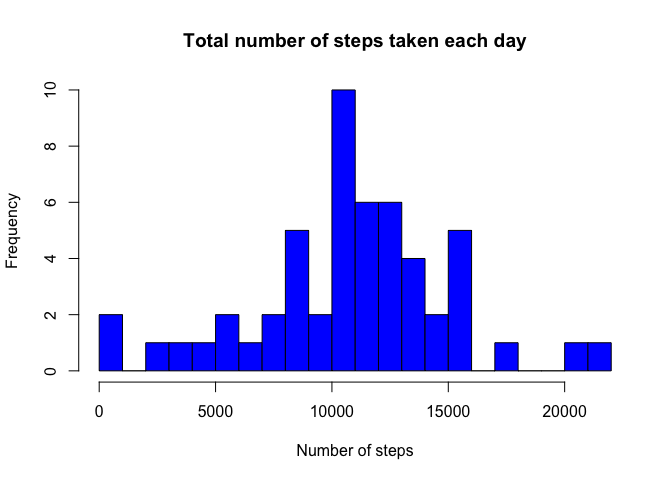
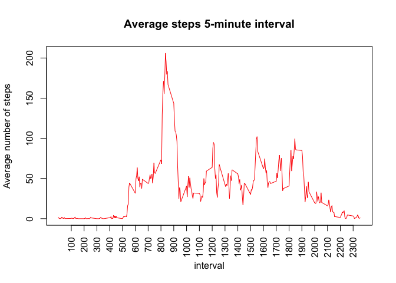

# Reproducible Research: Peer Assessment 1
## Loading and preprocessing the data

converted 'date' variable from factor to Date format.

```r
library("knitr")
suppressPackageStartupMessages(library("dplyr", quietly=TRUE))
library("dplyr")
library("ggplot2")

data <- read.csv("activity.csv", header = TRUE, sep = ",", na.strings = "NA")
data$date <- as.Date(data$date, format="%Y-%m-%d")
```


## What is mean total number of steps taken per day?

1. Calculate the total number of steps taken per day

```r
# split and join data by date
sumStepsPerDayDf <- data %>%
  filter(!is.na(steps)) %>%
  group_by(date) %>%
  summarise(sum.steps = sum(steps)) %>%
  print
```

```
## Source: local data frame [53 x 2]
## 
##          date sum.steps
## 1  2012-10-02       126
## 2  2012-10-03     11352
## 3  2012-10-04     12116
## 4  2012-10-05     13294
## 5  2012-10-06     15420
## 6  2012-10-07     11015
## 7  2012-10-09     12811
## 8  2012-10-10      9900
## 9  2012-10-11     10304
## 10 2012-10-12     17382
## ..        ...       ...
```

2. Make a histogram of the total number of steps taken each day

```r
hist(sumStepsPerDayDf$sum.steps, breaks = 20,  main = "Total number of steps taken each day", ylab = "Frequency", xlab = "Number of steps", col = "blue")
```

 

3 Calculate and report the mean and median of the total number of steps taken per day

```r
meanStepsPerDay <- mean(sumStepsPerDayDf$sum.steps)
medianStepsPerDay <- median(sumStepsPerDayDf$sum.steps)
meanStepsPerDay
```

```
## [1] 10766.19
```

```r
medianStepsPerDay
```

```
## [1] 10765
```


## What is the average daily activity pattern?

1. Make a time series plot (i.e. type = "l") of the 5-minute interval (x-axis) and the average number of steps taken, averaged across all days (y-axis)

```r
intervaldf <- data %>%
  filter(!is.na(steps)) %>%
  group_by(interval) %>%
  summarise(avg.steps = mean(steps))
plot(x = intervaldf$interval, y = intervaldf$avg.steps, type = "l", main = "Average steps 5-minute interval", ylab = "Average number of steps", xlab = "interval", xaxt="n", col = "red")
axis(1, at = seq(100, 2300, by = 100), las = 2)
```

 

2. Which 5-minute interval, on average across all the days in the dataset, contains the maximum number of steps?

```r
maxIntSteps <- subset(intervaldf, avg.steps == max(intervaldf$avg.steps))
maxIntSteps$interval
```

```
## [1] 835
```


## Imputing missing values

1. Calculate and report the total number of missing values in the dataset (i.e. the total number of rows with NAs)

```r
numOfMissingValues <- sum(is.na(data$steps))
numOfMissingValues
```

```
## [1] 2304
```

2. Response: The mean number of steps for each interval that was calculated without the NA's will be used to fill in the missing values for that repected interval.

3. Create a new dataset that is equal to the original dataset but with the missing data filled in.

```r
combined <- merge(intervaldf, data) %>%
  arrange(date)

combined$stepsFilledIn <- ifelse(is.na(combined$steps), combined$avg.steps, combined$steps)
# extract and order the columns to reflect the original data set structure
dataFilled <- combined[c(5, 4,1)]
```

4. Make a histogram of the total number of steps taken each day and Calculate and report the mean and median total number of steps taken per day. Do these values differ from the estimates from the first part of the assignment? What is the impact of imputing missing data on the estimates of the total daily number of steps?

```r
# sum of steps taken each day calculated from the dataFilled object
sumStepsPerDayFilledDf <- dataFilled %>%
  group_by(date) %>%
  summarise(sum.stepsFilledIn = sum(stepsFilledIn)) %>%
  print
```

```
## Source: local data frame [61 x 2]
## 
##          date sum.stepsFilledIn
## 1  2012-10-01          10766.19
## 2  2012-10-02            126.00
## 3  2012-10-03          11352.00
## 4  2012-10-04          12116.00
## 5  2012-10-05          13294.00
## 6  2012-10-06          15420.00
## 7  2012-10-07          11015.00
## 8  2012-10-08          10766.19
## 9  2012-10-09          12811.00
## 10 2012-10-10           9900.00
## ..        ...               ...
```

```r
hist(sumStepsPerDayFilledDf$sum.stepsFilledIn, breaks = 20,  main = "Total number of steps taken each day", ylab = "Frequency", xlab = "Number of steps", col = "blue")
```

 


The mean and median of the steps are calculated from the dataFilled object.

```r
mean <- mean(sumStepsPerDayFilledDf$sum.stepsFilledIn)
median <- median(sumStepsPerDayFilledDf$sum.stepsFilledIn)
mean
```

```
## [1] 10766.19
```

```r
median
```

```
## [1] 10766.19
```
The impact of filling in the missing values is prominent with the frequency value of the median number of steps as there are more enteries within the data set. Therefore, this will have a direct impact when performing other calculations such as finding the frequency range, standard deviation etc.

The average (mean) value is the same at 10766.19, however, the new median value is slightly increased from 10765 to 10766.19.


## Are there differences in activity patterns between weekdays and weekends?

1. Create a new factor variable in the dataset with two levels – “weekday” and “weekend” indicating whether a given date is a weekday or weekend day

```r
# A column 'weektype' is a factor variable created via mutate() from the dlpyr package. This column shall indicate whether the date is a "weekday"" or "weekend".

dataFilled <- mutate(dataFilled, weektype = ifelse(
  weekdays(dataFilled$date) == "Saturday" | weekdays(dataFilled$date) == "Sunday", "weekend", "weekday"))
dataFilled$weektype <- as.factor(dataFilled$weektype)
head(dataFilled)
```

```
##   stepsFilledIn       date interval weektype
## 1     1.7169811 2012-10-01        0  weekday
## 2     0.3396226 2012-10-01        5  weekday
## 3     0.1320755 2012-10-01       10  weekday
## 4     0.1509434 2012-10-01       15  weekday
## 5     0.0754717 2012-10-01       20  weekday
## 6     2.0943396 2012-10-01       25  weekday
```

2. Make a panel plot containing a time series plot (i.e. type = "l") of the 5-minute interval (x-axis) and the average number of steps taken, averaged across all weekday days or weekend days (y-axis).

```r
avgStepsByWeektype <- dataFilled %>%
  group_by(interval, weektype) %>%
  summarise(avg.stepsByWeektype = mean(stepsFilledIn))


panelPlot <- ggplot(avgStepsByWeektype, aes(x=interval, y=avg.stepsByWeektype, color = weektype, group = 1)) + geom_line() + facet_wrap(~weektype, ncol = 1, nrow=2) + ylab("average number of steps taken")
print(panelPlot)
```

 


